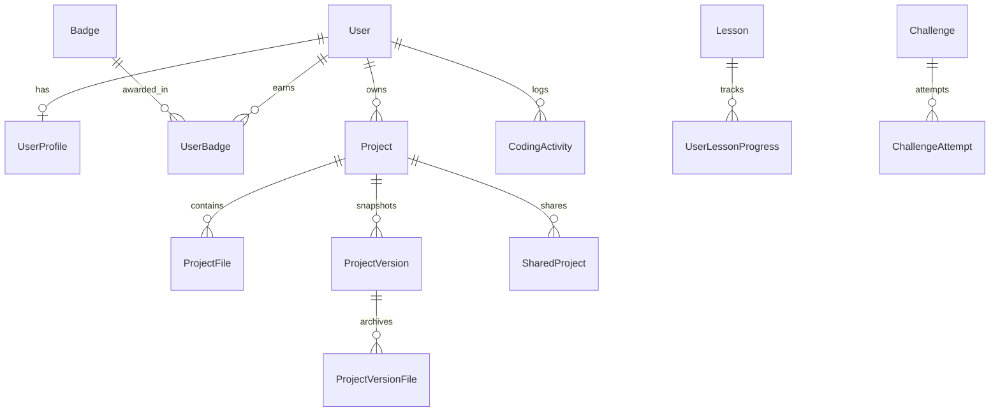

# 🤖 CodeBuddy — A Children's Friendly Online Coding Playground & IDE

> *"Make coding feel like an adventure, while keeping the actual coding experience professional."*

CodeBuddy is a production-quality, full-stack online programming platform specifically designed for school students, children, teenagers, and beginners. It seamlessly blends the playful, encouraging personality of **Duolingo and Scratch** with the real-world engineering power of a **modern online IDE**.

---

## 🌟 Key Product Highlights

- **Original Mascot "Byte"**: A friendly, responsive cartoon robot companion that cheers for successful code execution, guides students through syntax errors with educational hints, and tracks learning progress.
- **Child-Friendly Design Outside, Professional Inside**:
  - *Outside the editor*: Playful pastel colors (Sky Blue `#5BC0EB`, Purple `#9B6DFF`, Yellow `#FFD166`, Pink `#FF7EB6`, Mint `#65D6B3`), floating clouds, bouncy buttons, and rounded typography (`Fredoka` & `Nunito`).
  - *Inside the editor*: Clean, distraction-free Monaco Editor (`JetBrains Mono` typography, accessible syntax tokens, dark and light CodeBuddy themes).
- **Real Multi-File Projects**: Create and switch between `index.html`, `style.css`, `script.js`, `main.py`, `main.c`, `main.cpp`, `Main.java` with language-specific icons and path traversal protection.
- **Time-Traveling Project History**: Every milestone save automatically records a non-destructive version snapshot. Restore previous versions anytime without losing current work.
- **Sandboxed Execution & Architecture**:
  - *Web (HTML, CSS, JS)*: Isolated sandboxed `<iframe>` execution with live two-way console log interception and runtime error reporting.
  - *Server Languages (Python)*: Isolated execution runner with strict timeouts, stdin handling, memory safeguards, and pluggable remote sandbox interfaces.
- **Beginner Template Library**: 14+ complete, working templates (Digital Clock, Calculator, To-Do List, Guessing Game, Rock Paper Scissors, Portfolio, etc.).
- **Learn & Code Tracks**: Interactive, step-by-step lessons across HTML, CSS, JavaScript, and Python with concept cards, explanations, and instant try-it sandboxes.
- **Automated Coding Challenges**: Test case runner evaluating stdout against expected outputs with XP awards and celebratory confetti.
- **Public Project Sharing & Remix**: Generate shareable snapshots (`/share/<id>`) that friends and teachers can run, inspect, and fork/remix into their own workspace.
- **Export & Download**: One-click download of individual files or complete projects packaged as clean `.zip` archives.

---

## 🏗️ Architecture & Technology Stack

```
[ Frontend: React 19 + Vite + Tailwind CSS + Monaco Editor ]
          |
          +---> Local Sandboxed iframe (HTML/CSS/JS + postMessage console bridge)
          |
          +---> Django REST Framework Backend (Port 8000)
                   |
                   +---> SimpleJWT Authentication (Register, Login, Me, Refresh)
                   +---> Projects App (CRUD, Multi-file explorer, Debounced autosave)
                   +---> Versioning System (ProjectVersion & ProjectVersionFile)
                   +---> Pluggable Code Execution Service (Python runner + sandbox API hooks)
                   +---> Sharing Engine (Public snapshot tokens & remix handler)
                   +---> Learning & Challenges Engine (Automated test evaluation)
                   +---> Gamification (XP, Levels, Badges)
                   +---> SQLite / PostgreSQL Database
```

### Frontend
- **Framework**: React 19, Vite
- **Styling**: Tailwind CSS v4, custom CodeBuddy design tokens
- **Code Editor**: `@monaco-editor/react` (custom CodeBuddy Dark & Light themes)
- **Icons & Animation**: `lucide-react`, `canvas-confetti`, custom CSS keyframes
- **Networking**: `axios` with JWT request/response interceptors & token rotation
- **Utilities**: `jszip` for project zip archiving

### Backend
- **Framework**: Python 3.14, Django 6, Django REST Framework
- **Authentication**: `rest_framework_simplejwt` (JWT bearer tokens)
- **CORS**: `django-cors-headers`
- **Database**: SQLite (Development) / PostgreSQL compatible

---

## 🗄️ Database Design



- **`UserProfile`**: Stores `display_name`, `avatar`, `xp`, `level`, and `streak_days`. Auto-created upon user registration.
- **`Badge` & `UserBadge`**: Gamification system tracking awards such as *First Step*, *World Creator*, *Safety First*, *Engine Ignited*, and *Puzzle Master*.
- **`Project` & `ProjectFile`**: Multi-file storage with language flags, filename uniqueness, and `is_main` identifiers.
- **`ProjectVersion` & `ProjectVersionFile`**: Immutable historical checkpoints created on save or restore.
- **`SharedProject`**: Public snapshot with randomized secure token (`secrets.token_urlsafe`) and view count tracking.
- **`CodingActivity`**: User journey timeline capturing project creations, runs, saves, and challenge completions.
- **`Lesson` & `UserLessonProgress`**: Structured curriculum tracks for HTML, CSS, JavaScript, and Python.
- **`Challenge` & `ChallengeAttempt`**: Coding puzzles with JSON test cases evaluated against student submissions.

---

## 🔌 API Endpoints Summary

### Authentication (`/api/auth/`)
- `POST /api/auth/register/`: Register a new student account (grants welcome badge).
- `POST /api/auth/login/`: Authenticate user and receive JWT access and refresh tokens.
- `POST /api/auth/token/refresh/`: Rotate expired access tokens.
- `POST /api/auth/logout/`: Invalidate session.
- `GET /api/auth/me/`: Retrieve current user profile, level, XP, and badges.
- `GET /api/auth/badges/`: View list of all available and earned badges.

### Projects & Files (`/api/projects/`)
- `GET /api/projects/`: List all user projects with file summaries.
- `POST /api/projects/`: Create a new project seeded with default starter files.
- `GET /api/projects/<id>/`: Retrieve project details and files.
- `PATCH /api/projects/<id>/`: Update project metadata (name, description, visibility).
- `DELETE /api/projects/<id>/`: Delete project.
- `POST /api/projects/<id>/duplicate/`: Clone a project and its files.
- `POST /api/projects/<id>/save/`: Batch save files with optional version snapshot creation.
- `POST /api/projects/<id>/files/`: Create a new file in the project.
- `PATCH /api/projects/files/<file_id>/`: Rename or update file content.
- `DELETE /api/projects/files/<file_id>/`: Remove file from project.

### Project History & Restoration (`/api/projects/<id>/history/`)
- `GET /api/projects/<id>/history/`: List all snapshot versions.
- `GET /api/projects/<id>/history/<version_number>/`: Inspect files within a specific version.
- `POST /api/projects/<id>/restore/<version_number>/`: Non-destructive rollback: snapshots current state as backup, restores target version files, and logs restoration activity.

### Execution Service (`/api/execute/`)
- `POST /api/execute/`: Execute code securely. Returns `{ status, stdout, stderr, execution_time, exit_code }`.

### Sharing (`/api/share/`)
- `POST /api/share/project/<project_id>/`: Create a public shareable snapshot token.
- `GET /api/share/<share_id>/`: Anonymous read-only access to a shared project.
- `POST /api/share/<share_id>/remix/`: Fork a shared project snapshot into the logged-in user's workspace.

### Learning & Challenges (`/api/learning/`, `/api/challenges/`)
- `GET /api/learning/lessons/`: List lessons (filterable by `?track=html|css|javascript|python`).
- `POST /api/learning/lessons/<slug>/complete/`: Complete lesson and claim XP.
- `GET /api/challenges/`: List coding challenges with difficulty ratings.
- `POST /api/challenges/<slug>/submit/`: Run solution against automated test cases and record attempt score.

### Dashboard (`/api/dashboard/`)
- `GET /api/dashboard/`: Personalized greeting, stats metrics, recent projects, earned badges, and activity timeline.

---

## 🚀 Quickstart & Local Installation

### Prerequisites
- **Python 3.10+** (Tested on Python 3.14)
- **Node.js 18+** (Tested on Node.js v24)
- **npm** (v9+)

---

### 1. Backend Setup

```bash
# Navigate to backend directory
cd backend

# (Optional) Create and activate virtual environment
python -m venv venv
# Windows:
venv\Scripts\activate
# Linux/macOS:
source venv/bin/activate

# Install dependencies (if not already installed globally)
pip install django djangorestframework djangorestframework-simplejwt django-cors-headers

# Run database migrations
python manage.py makemigrations
python manage.py migrate

# Seed badges, lessons, and challenges
python manage.py seed_data

# Start the Django development server
python manage.py runserver 8000
```
*Backend will be running at:* `http://localhost:8000`

---

### 2. Frontend Setup

```bash
# Open a new terminal and navigate to frontend directory
cd frontend

# Install dependencies
npm install

# Start Vite development server
npm run dev
```
*Frontend will be running at:* `http://localhost:5173`

---

## 🧪 Testing the Application

### Automated Backend Tests
Run the Django test suite to verify authentication, project lifecycle, version history, sharing, and code execution:
```bash
cd backend
python manage.py test
```

### Production Build Verification
Verify that the frontend builds with zero syntax or bundling errors:
```bash
cd frontend
npm run build
```

---

## 📋 Comprehensive Testing Checklist

- [x] **Authentication**:
  - Register a new child user (e.g., `alexcoder`).
  - Welcome badge and initial XP automatically granted.
  - Login with JWT token stored securely in localStorage.
  - Token refresh and protected endpoints properly authorized.
- [x] **Project Management**:
  - Create a new project (HTML or Python).
  - Rename project inline from toolbar.
  - Multi-file operations: add `about.html`, edit `style.css`, delete extra files.
  - Duplicate project into a fresh copy.
- [x] **Monaco Code Editor**:
  - Custom CodeBuddy Dark (`#182033`) and Light themes.
  - Monospace developer font (`JetBrains Mono`).
  - Keyboard shortcuts (`Ctrl + Enter` to Run, `Ctrl + S` to Save).
  - Font size, word wrap, and minimap preferences persisted in settings.
- [x] **Code Execution & Output**:
  - HTML/CSS/JS executes in sandboxed iframe with live preview.
  - Real-time `console.log` interception and console panel capture.
  - Python programs execute with stdin input and output stdout/stderr.
  - Friendly educational hints from Byte when errors occur.
- [x] **Project History & Time-Travel**:
  - Milestone saves create incremental versions.
  - Inspect files in past versions.
  - Safe rollback preserves current state and restores past files.
- [x] **Sharing & Remixing**:
  - Generate share token (`/share/<id>`).
  - Read-only preview with live runner.
  - Remix / Fork into current user's workspace.
- [x] **Export**:
  - Download single file or full project as `.zip`.
- [x] **Learning & Challenges**:
  - Interactive "Learn & Code" lessons with concept explanations.
  - Automated test runner for challenges with confetti and XP awards.
- [x] **Student Dashboard**:
  - Personalized welcome: *"Hey, Alex! Ready to code?"*
  - Real metrics: Projects, Sessions, Challenges, Languages, and Badges.

---

## 🛡️ Security Architecture

1. **Sandboxed Web Execution**: Web apps render inside an isolated `<iframe>` with `sandbox="allow-scripts allow-modals"`, strictly preventing preview code from accessing parent window storage, cookies, or DOM.
2. **Server-Side Isolation**: User code is never executed directly inside the Django server process. Python scripts run in isolated subprocesses with environment isolation (`-I`), non-root temp directories, and strict timeouts (4 seconds).
3. **No Arbitrary Path Traversal**: Filenames are validated against directory traversal (`..`, absolute paths) before writing or reading.
4. **JWT Security**: Passwords hashed using Django PBKDF2. Endpoints verify `request.user` server-side and never trust client-provided user IDs.

---

## 🔮 Future Scope

- Containerized Docker / gVisor runners for sandboxed C, C++, and Java execution.
- Classroom mode: Teachers can assign coding assignments and review student submissions.
- Collaborative live pair-programming via WebSockets.
- Voice-enabled speech feedback from Byte the robot for early-grade readers.

---

*Built with ❤️ for young programmers, students, and educators.*
